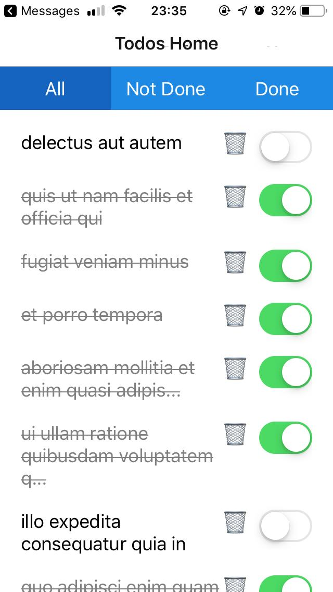
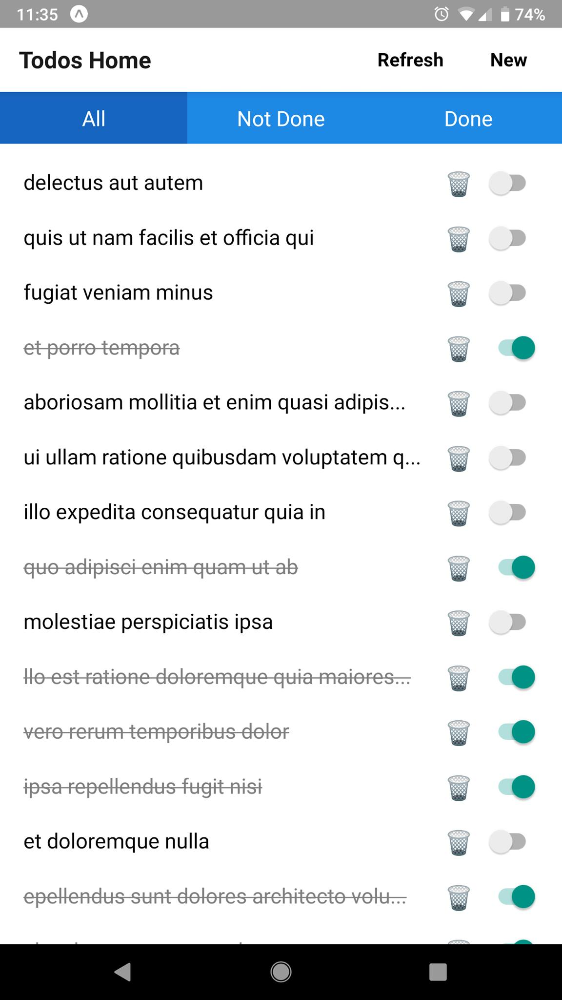

# Todo React Native
A sample todo application built with React Native, Redux &amp; React Navigation routing built as a learning experience. Created using [Expo](https://facebook.github.io/react-native/docs/getting-started.html)'s blank React Native app template.

### iOS (4" iPhone SE)

### Android (5.5" Google Pixel XL)

## How to Run
1. Clone repository and navigate to project root
2. Run `npm install`
3. Run `npm start`
4. On a smartphone connected to the same WiFi connection as the running machine, download the Expo [iOS](https://itunes.apple.com/us/app/expo-client/id982107779?mt=8) / [Android](https://play.google.com/store/apps/details?id=host.exp.exponent&hl=en) mobile app, and open the QR code/URL shown on the http://localhost:19002/ page opened by default when you run `npm start`
5. Profit.
